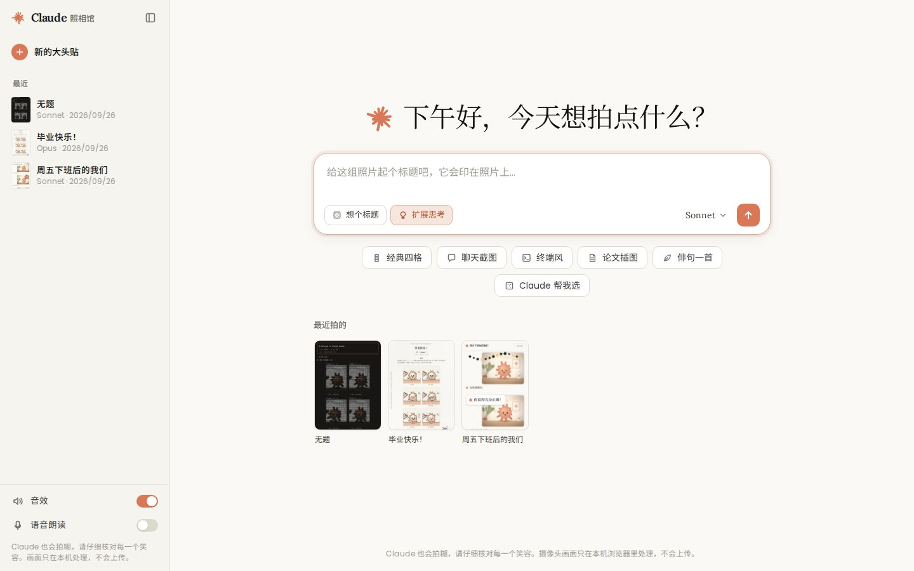
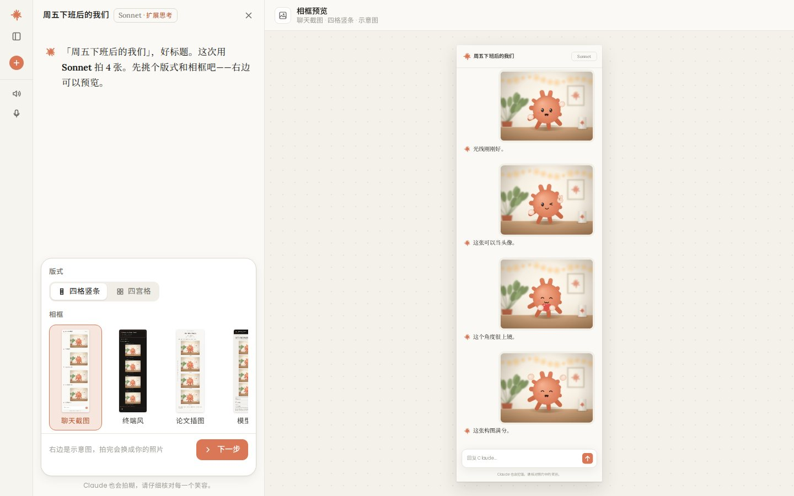
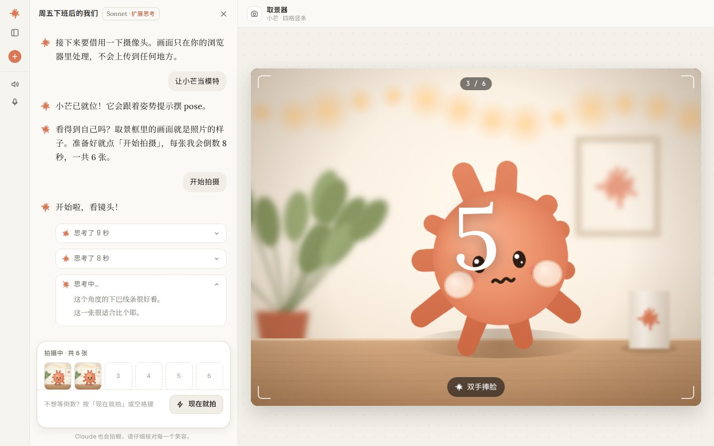
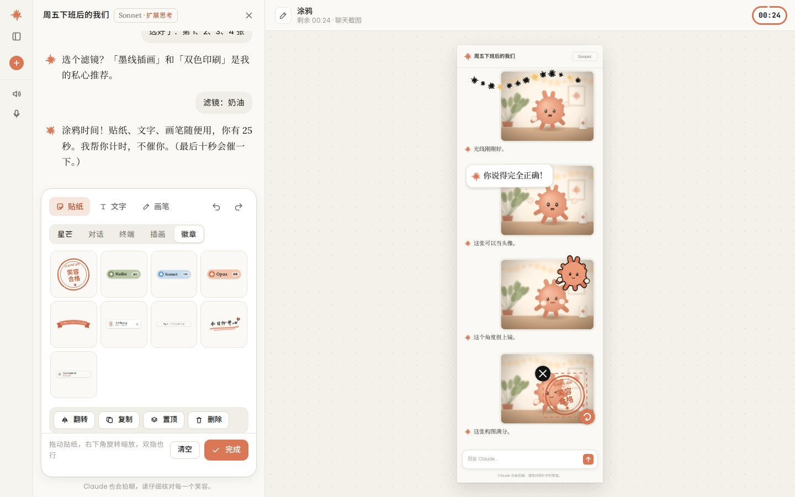
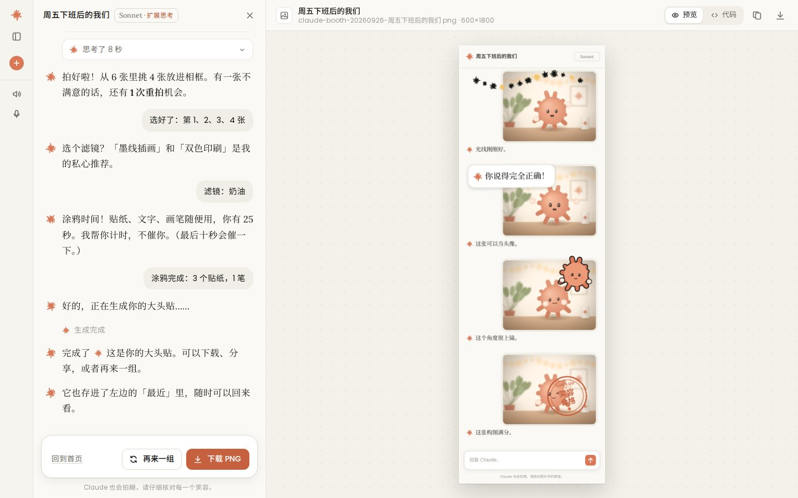
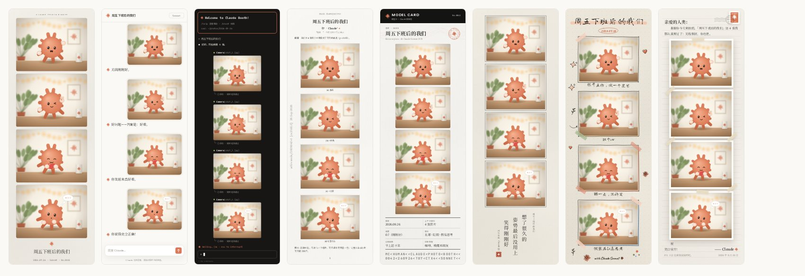

# ✻ Claude 大头贴照相馆

一台开在浏览器里的 Claude 主题大头贴机。界面照着 claude.ai 做：左边是和 Claude 的对话，Claude 一步步带你拍；右边是 Artifact 面板，实时显示取景器和照片。选相框、倒数拍照、选片重拍、选滤镜、限时涂鸦，最后照片从出片口「打印」出来，存进侧栏的「最近」。

所有图像都是 JavaScript 在 Canvas 上画的，包括星芒标志、吉祥物小芒、演示用的拍摄场景、相框、贴纸、画笔和滤镜。仓库里没有图片素材。



| | |
|---|---|
|  |  |
| 选版式和相框，右边是示意图 | 开着「扩展思考」拍摄：倒数更长，Claude 的思考过程会一行行出现 |
|  |  |
| 限时涂鸦：贴纸、文字、画笔 | 成片作为 Artifact 展示，有「预览 / 代码」两个页签 |

## 怎么玩

1. **起个标题。** 首页的输入框像 claude.ai 的对话框，写的这句话会印在照片上。不知道写什么，可以点「想个标题」。
2. **选模型。** 模型名本身就是诗体，所以也决定了玩法：

   | 模型 | 拍摄 | 放进相框 | 每张倒数（第一张多给一两秒） | 涂鸦时间 | 版式 |
   |---|---|---|---|---|---|
   | **Haiku** 俳句 | 3 张 | 3 张 | 3 秒 | 75 秒 | 三格竖条、一大两小 |
   | **Sonnet** 十四行诗 | 6 张 | 挑 4 张 | 5 秒 | 2 分钟 | 四格竖条、四宫格 |
   | **Opus** 巨作 | 8 张 | 挑 6 张 | 5 秒 | 3 分钟 | 六宫格、双竖条 |

   打开**扩展思考**后，每张倒数多 3 秒，Claude 会边想边给你提建议（「肩膀放松，下巴微微收一点」），想完会折叠成「思考了 8 秒」。
3. **选版式和相框。** 右边会用小芒的照片预览效果。
4. **打开摄像头，或者让小芒当模特。** 没有摄像头、不想开、权限被拒都没关系：吉祥物小芒会在一个小摄影棚里按姿势提示摆 pose，完整流程照样能走完。
5. **拍摄。** 开拍前可以选一个拍摄道具（星芒光环、思考泡泡、夸夸卡片、终端字幕、和小芒合影），它会出现在取景器里，也会印进每张照片。每张都有倒数、姿势提示（比个耶、假装在认真思考、张开五指做一个星芒……）和快门声。按空格键可以立即拍。
6. **选片。** 按点选顺序放进相框，整次拍摄有 1 次重拍机会。
7. **滤镜和美颜。** 滤镜作用在所有照片上，美颜分原生、自然、奶油肌三档。
8. **涂鸦。** 限时。贴纸可以拖动，右下角的手柄可以旋转缩放（双指也行），还能翻转、复制、置顶、撤销。
9. **出片。** 照片从出片口一点点出来，然后以 Artifact 的形式展示：可以下载 PNG（按 2×6 / 4×6 英寸、300 dpi 的冲印尺寸出图，600×1800 或 1200×1800 像素）、复制、分享，或者切到「代码」页签看这张大头贴的「源码」。

## 相框

8 款相框，每款都适配全部 6 种版式（三格竖条、四格竖条、一大两小、四宫格、六宫格、双竖条）。



| 相框 | 样子 |
|---|---|
| 奶油纸 | 暖白纸、细线和一枚小星芒，标题用衬线体印在底部 |
| 聊天截图 | 整张照片是一段 claude.ai 对话：你发照片，Claude 在每张下面回你一句 |
| 终端风 | 一次 Claude Code 会话：欢迎框，你的标题是 prompt，每张照片是一次 `Camera(shot_1.jpg)` 工具调用，最底下是 `Smiling… (esc to interrupt)` |
| 论文插图 | 一页学术论文：标题、作者「你¹ · Claude²」、摘要，照片是「图 1」，左边还有一行 arXiv 风格的编号 |
| 模型卡 | 给照片里的人类写的 Model Card：版本、上下文窗口、温度、擅长、已知局限，底部一行护照式机读码 |
| 俳句 | 和纸上竖排一首俳句（五、七、五），配一枚星芒印章 |
| 手账插画 | 手绘墨线框、和纸胶带，照片下面是手写的姿势说明，四周是小涂鸦 |
| 来信 | Claude 写来的一封信：「亲爱的人类：」，照片用胶带贴在信纸上，右上角有邮票和邮戳 |

## 滤镜

原片、奶油、陶土、墨色、旧书页、**墨线插画**（描边 + 平涂，像一张手绘插画）、**双色印刷**（蓝橙两色网点，轻微错版）、像素（12 色）、**终端 ASCII**（用字符拼出你的样子）。除 ASCII 外都是同一个 WebGL 片元着色器，美颜（保边磨皮 + 提亮）也在里面。

## 涂鸦

<!-- stickers -->

- **文字**：衬线、「Claude 说」对话卡片、手写、终端、粗体五种样式，还有常用语一键添加。
- **画笔**：墨水笔、马克笔、荧光笔、描边笔、星芒笔、点点笔、虚线笔、渐变笔和橡皮。笔画单独放在一层，橡皮不会擦到照片。

## 彩蛋

- 输入框支持斜杠命令：`/haiku` `/sonnet` `/opus` 选模型，`/chat` `/terminal` `/paper` `/card` `/doodle` `/letter` 选相框，`/ascii` `/ink` `/riso` 选滤镜。
- 输入 `ultrathink` 会打开扩展思考，而且想得更多。
- 首页的「Claude 帮我选」随机挑一套模型、相框和滤镜。

## 运行

摄像头只能在 `https://` 或 `http://localhost` 下使用。

```bash
npm start            # 等于 node scripts/serve.mjs，然后打开 http://localhost:5173
```

任何静态服务器都可以（`npx serve`、`python3 -m http.server`），也可以直接部署到 GitHub Pages（根目录已经有 `.nojekyll`）。不需要构建，也没有运行时依赖。

**隐私**：摄像头画面只在浏览器里处理，不会上传；拍好的照片存在本机浏览器的 IndexedDB 里，侧栏的「最近」就是从这里读的。

## 代码结构

纯静态网页，原生 ES Modules，没有框架。

```
index.html
css/app.css            设计变量（浅色 / 深色）、侧栏、首页、弹层
css/booth.css          对话栏、Dock、Artifact 面板、取景器、涂鸦、出片
js/main.js             路由：#/ 首页，#/booth 拍摄，#/p/<id> 回看
js/core/               DOM、工具函数、字体预载、文字排版、WebAudio 音效、存储
js/art/                星芒、吉祥物小芒和演示场景、手绘墨线工具、图标、贴纸、文字贴纸
js/photo/              版式、相框、合成、WebGL 滤镜、摄像头、涂鸦编辑器、画笔
js/app/                外壳、首页、拍摄流程（steps/）、对话、Dock、Artifact 面板、回看页
js/data/               模型设定和 Claude 的台词
dev/gallery.html       素材图鉴
tests/                 Playwright 端到端测试和截图脚本
```

几个可以单独看的部分：

- `js/art/spark.js`：星芒是一组长短不一的圆头射线，可以呼吸、旋转、加描边，同时输出 Canvas `Path2D` 和 SVG path。
- `js/art/mascot.js`：小芒的 11 种姿势（外加待机），以及没有摄像头时替代摄像头的演示场景（有背景虚化、灯串光斑、颗粒和暗角）。
- `js/photo/fx.js`：滤镜着色器和 ASCII 渲染。
- `js/photo/editor.js`：涂鸦编辑器。所有东西按打印像素记录，出片时按全分辨率重新绘制。

## 开发与测试

```bash
npm install                                  # 只装 Playwright，测试才需要
npm test                                     # 用 Chromium 假摄像头把 Sonnet 从头拍到尾，截图存到 test-results/
MODEL=opus DEMO=1 node tests/e2e.mjs         # 拒绝摄像头权限，让小芒当模特
MODEL=haiku MOBILE=1 node tests/e2e.mjs      # 手机尺寸
TITLE="ultrathink 周末" node tests/e2e.mjs    # 扩展思考
node tests/shot.mjs "/dev/gallery.html?s=frames,stickers,filters" test-results/g.png 1500 1000 --full
node tests/screens.mjs                       # 重新生成 README 里的截图
```

URL 加 `?fast=1` 会缩短所有倒数和计时，方便调试。素材图鉴 `dev/gallery.html?s=spark,mascot,scene,frames,stickers,filters` 能一次看到所有素材，相框部分支持 `frame=`、`layout=`、`title=`、`scale=` 参数。

## 说明

- 这是一个粉丝向的练习项目，和 Anthropic 没有关联。Claude 是 Anthropic 的商标。星芒图形是仿照 Claude 标志的风格用代码画的，不是官方素材。
- 配色取自 Anthropic 公开的 brand-guidelines skill（[anthropics/skills](https://github.com/anthropics/skills/blob/main/skills/brand-guidelines/SKILL.md)）：`#141413` `#faf9f5` `#d97757` `#6a9bcc` `#788c5d` `#b0aea5` `#e8e6dc`，其余是从这几个颜色调出来的辅助色。
- 字体来自 Google Fonts：Lora、Poppins、Noto Serif SC、Noto Sans SC、JetBrains Mono、Caveat、Long Cang（SIL Open Font License）。加载失败时会退回系统字体。
