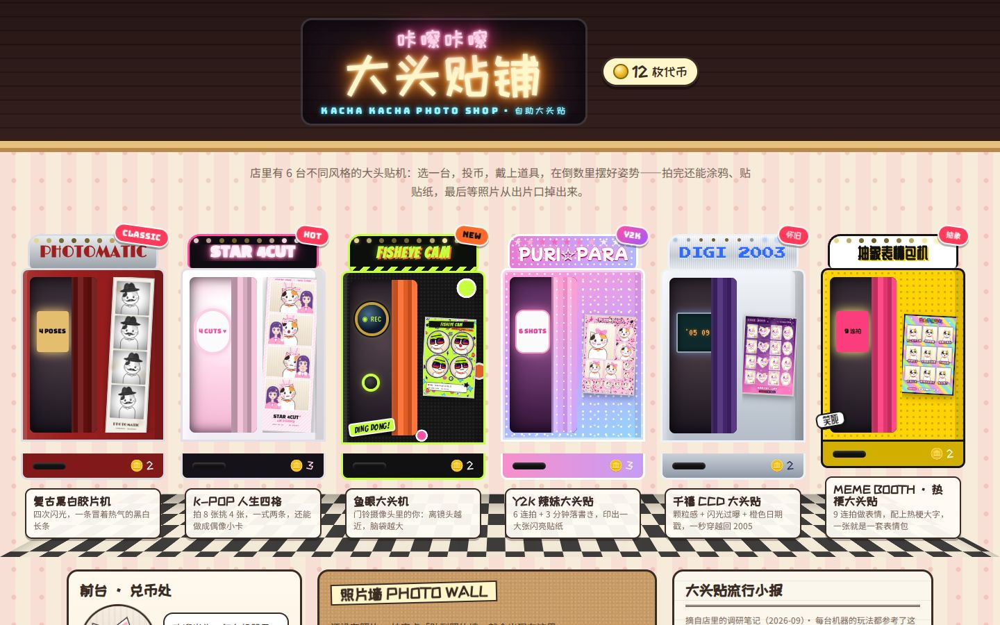
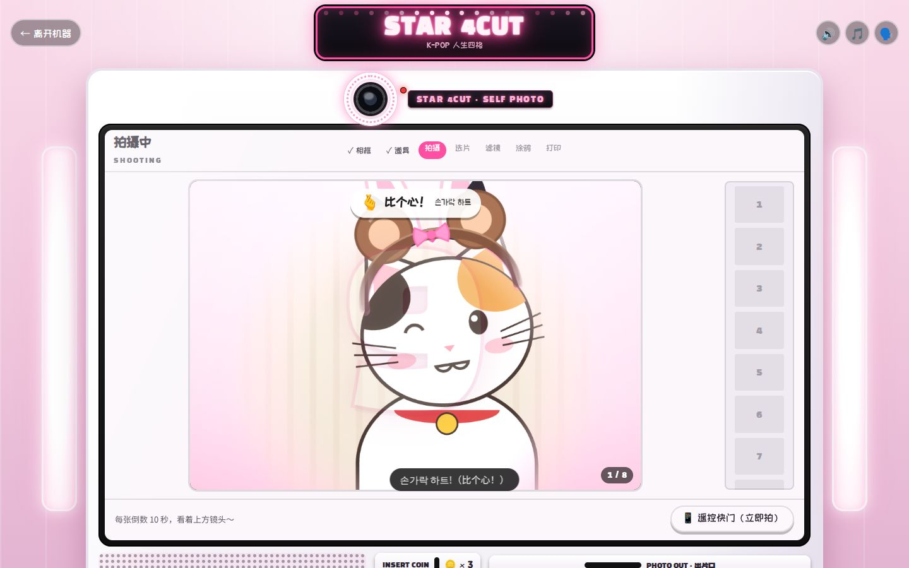
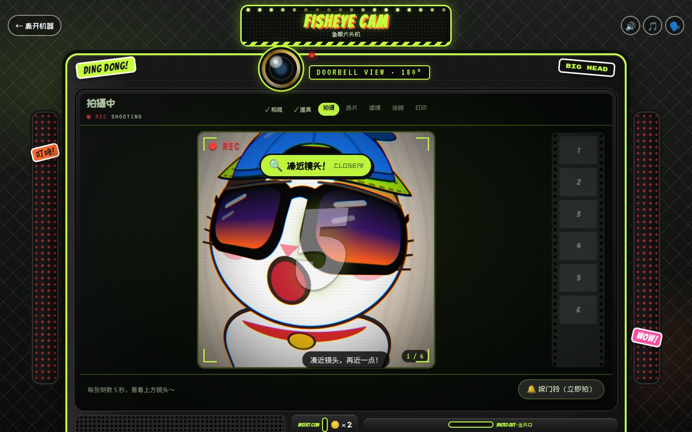
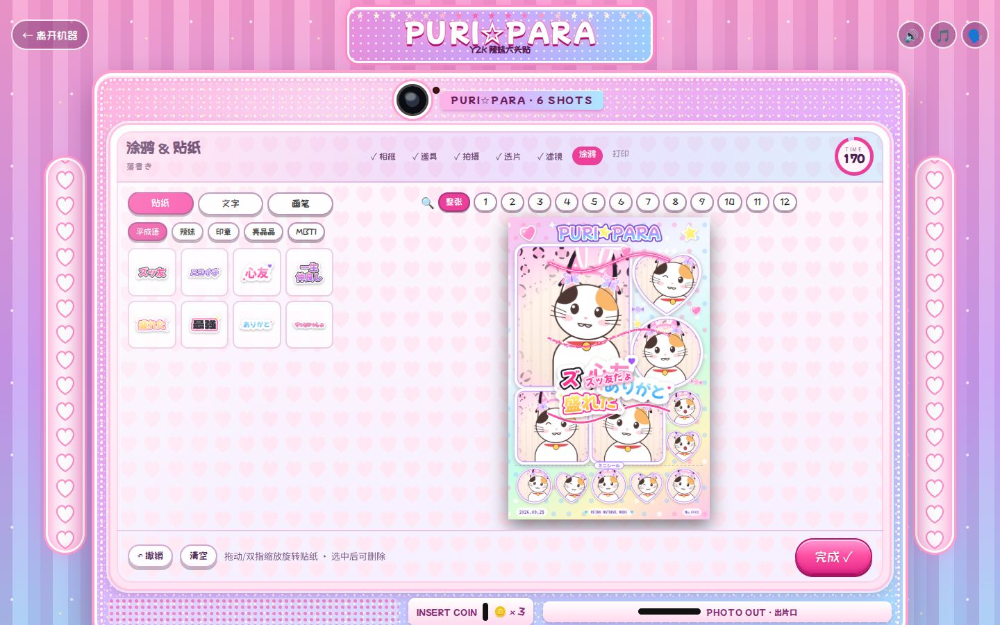
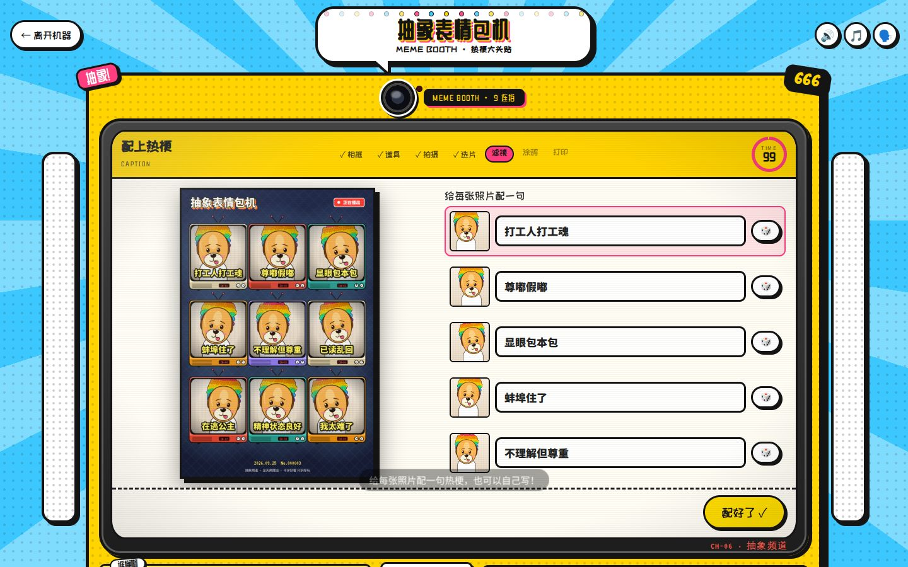
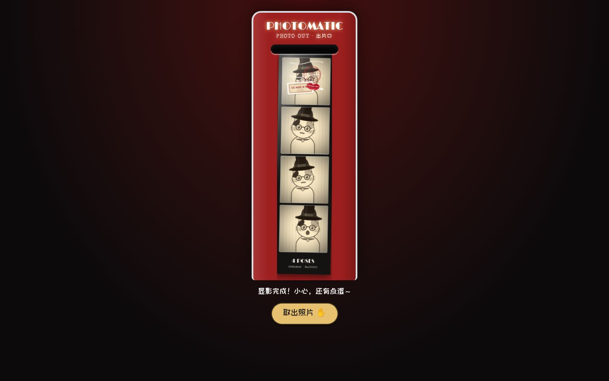
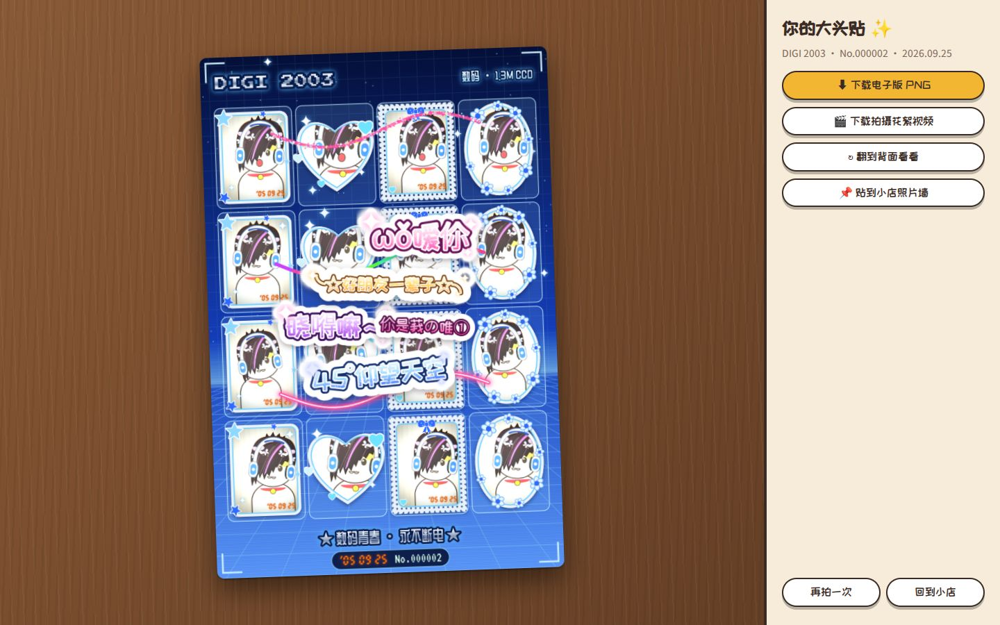

# 📸 咔嚓咔嚓大头贴铺 · KACHA KACHA PHOTO SHOP

一家开在浏览器里的复古大头贴小店。店里摆着 6 台风格不同的大头贴机，每台都尽量还原线下的拍摄流程：投币、选相框、从道具架拿道具、倒数拍照（有一次重拍机会）、选片、调滤镜、限时涂鸦贴贴纸，最后看着照片从出片口一点点吐出来。



- **调研**：[docs/research.md](docs/research.md)，整理了韩国人生四格、日本プリクラ、国内大头贴回潮和欧美化学机的品牌、流程和风格，每条都附了来源。
- **机器开发说明**：[docs/THEME_API.md](docs/THEME_API.md)

## 店里的 6 台机器

| 机器 | 线下原型（见调研） | 这台机器的玩法 |
|---|---|---|
| **PHOTOMATIC** 复古黑白胶片机 | 欧美化学显影照相亭：4 次闪光，等 3–4 分钟，拿到一条温热潮湿的四格竖条 | 4 连拍，2×8 英寸长条；硬闪或柔光；黑白、棕褐、蓝晒、褪色彩色四种冲洗；礼帽、八字胡、烟斗等 11 件道具；打印时屏幕播放「曝光 → 显影 → 定影 → 烘干」，照片出来后慢慢显影 |
| **STAR 4CUT** K-POP 人生四格 | 韩国自助照相馆：拍 8–10 张、每张约 10 秒，挑 4 张，一次打印两条；偶像联名框、小卡文化 | 8 张 × 10 秒倒数，可用遥控快门，挑 4 张；人生四格竖条（一式两条）、MULTI 四宫格、55×85mm 偶像小卡三种版式；和原创虚拟偶像 STARRY 的合照框、小卡套装饰；6 种换色背景 |
| **FISHEYE CAM** 鱼眼大头机 | 韩国租赁机的平视鱼眼「门铃视角」 | 3 档鱼眼强度，圆形猫眼或全画幅；四连猫眼、超大猫眼、监控三连三种版式；夜视仪、监控画面等滤镜；「按门铃」立即拍 |
| **PURI☆PARA** Y2K 辣妹大头贴 | 日本プリ机：おまかせ模式固定 6 张，涂鸦台限时 3–5 分钟，平成风和荧光笔回潮 | 「平成浓妆 / 令和自然」两档盛れ（美白、磨皮、大眼）；星星、豹纹、斑马纹等 6 种背景；拍完移动到涂鸦台，3 分钟落書き（荧光笔、闪粉笔、平成流行语贴纸）；打印成一大张可撕的贴纸 |
| **DIGI 2003** 千禧 CCD 大头贴 | CCD 怀旧：颗粒、闪光过曝、橙色日期戳；千禧年代的「非主流」 | 低像素传感器质感；闪光灯开关；日期戳可以「穿越回 2005」；4×4 迷你贴纸、2×2、翻盖手机屏幕三种版式；非主流斜刘海、翻盖手机等道具；火星文贴纸 |
| **抽象表情包机** MEME BOOTH | 国内的热梗、方言模板大头贴（38 元拍 9 张） | 9 张 × 3 秒快拍；每张配一句热梗（24 句可选，也能自己写）；九宫格、四宫格、单张表情包三种版式；电子包浆、像素风、哈哈镜等滤镜 |

所有道具、贴纸、相框、背景都是用代码画的原创素材（SVG / Canvas），没有用真实艺人或品牌形象。

## 截图

截图用的是「店猫演示模式」（没有摄像头时，由店猫咔咔当模特）。

| | |
|---|---|
|  |  |
| K-POP 人生四格：倒数拍摄，屏幕上有姿势提示，同时念韩语语音、显示中文字幕 | 鱼眼大头机：门铃视角的鱼眼镜头 |
|  |  |
| Y2K 辣妹大头贴：限时涂鸦，平成流行语贴纸 | 抽象表情包机：每张配一句热梗 |
|  |  |
| 复古黑白胶片机：照片从出片口出来，慢慢显影 | 千禧 CCD 大头贴：4×4 迷你贴纸，带橙色日期戳 |

## 一次完整的拍摄

1. **待机画面**：机器屏幕循环播放样张，点屏幕开始。
2. **投币**：点代币投进投币口。代币不够可以去前台免费兑换。
3. **机器专属选项**：比如闪光灯、鱼眼强度、美颜程度、日期戳。每一步都有倒计时，时间到自动选定。
4. **选相框**：先选版式，再选相框，预览会带上刚才的选项（比如日期戳年份）。
5. **道具 & 背景**：打开摄像头，从道具架挑道具。AR 道具会跟着脸走（用 MediaPipe 做人脸检测）；部分机器还能换背景（人像分割）。
6. **拍摄**：每张都有倒数、姿势提示、提示音和机器语音，最后是闪光和快门声。
7. **选片 + 一次重拍**：挑出要放进相框的照片，任意一张可以重拍一次。
8. **滤镜**（表情包机还有「配字」）。
9. **涂鸦**：贴纸、文字、多种画笔（霓虹、描边、亮片、爱心印章、喷漆、粉笔等），限时完成。可以放大到单张照片来装饰。Y2K 机和日本プリ机一样，拍完要「移动到涂鸦台」。
10. **最后确认**：打印前检查成片，还有时间的话可以回去再改。
11. **打印**：屏幕显示热升华色带的黄、品、青、保护膜四遍（复古机显示药水冲洗），然后照片从出片口一点点出来。
12. **拿到照片**：可以翻到背面看背印，下载 PNG 电子版和拍摄花絮视频，也可以贴到店里的照片墙。

没有摄像头或没给权限时，可以让店里的招财猫「咔咔」当模特（演示模式），流程照样能走完。

## 运行

摄像头只能在 `https://` 或 `http://localhost` 下使用，直接双击打开 HTML 文件不行。

```bash
node scripts/serve.mjs        # 或 npm start，然后打开 http://localhost:5173
```

任何静态服务器都可以（`npx serve`、`python3 -m http.server`），也可以直接部署到 GitHub Pages 这类静态托管。不需要构建。

AR 道具和换背景用的 MediaPipe 默认从 jsDelivr CDN 加载，模型文件已经放在 `assets/models/`。离线或内网使用时，运行 `npm run vendor` 把 MediaPipe 下载到 `vendor/mediapipe/`，程序会优先用本地的。加载失败时自动切换成「拖动道具」模式。

**隐私**：摄像头画面只在浏览器里处理，不会上传。照片墙存在浏览器的 IndexedDB 里。

## 技术要点

- 纯静态、原生 ES Modules，没有框架，不需要构建。
- `js/engine/glfx.js`：单 pass 的 WebGL 着色器，负责所有滤镜——黑白、棕褐、蓝晒、鱼眼、磨皮、美白、大眼、柔焦、颗粒、暗角、色差、像素化、电子包浆、漏光、闪光过曝。
- `js/engine/stage.js`：实时取景，处理裁切、镜像、换背景、AR 道具和全分辨率抓拍。
- `js/engine/decorate.js` + `pens.js`：贴纸编辑器（拖动、双指缩放旋转、翻转、撤销）和 10 种画笔；笔画按打印像素记录，出片时重新绘制。
- `js/engine/printer.js`：热升华打印的分色预渲染。
- `js/core/audio.js`：WebAudio 实时合成所有音效和背景音乐（投币、倒数、闪光灯充电、快门、打印机马达），机器语音用 SpeechSynthesis，同时显示字幕。
- `js/engine/recorder.js`：用 MediaRecorder 录下拍摄过程，作为花絮视频。

```
index.html          入口
css/                基础、大厅、机器、打印样式；css/themes/ 放每台机器的外观
js/core/            工具函数、存储、音频、字体
js/engine/          摄像头、视觉、WebGL 滤镜、取景舞台、排版、贴纸、画笔、打印、录像
js/booth/           机器外壳和各个步骤（intro / setup / shoot / finish）
js/shop/            大厅和趋势小报
js/themes/<id>/     每台机器的配置（index.js）和美术素材（art.js）
js/dev/, dev/       主题素材图鉴（dev/gallery.html?theme=<id>）
assets/models/      MediaPipe 人脸检测和人像分割模型
tests/              Playwright 端到端测试和截图脚本
```

## 开发与测试

```bash
npm install                         # 安装 Playwright（只有测试需要）
npm start                           # 本地服务器
node tests/e2e.cjs classic kpop     # 用 Chromium 假摄像头把指定机器从头拍到尾，截图存到 test-results/
DEMO=1 node tests/e2e.cjs meme      # 拒绝摄像头权限，走「店猫演示模式」
node tests/gallery.cjs y2k          # 截图某台机器的全部素材（道具会戴在人形假人和店猫上）
```

`tests/e2e.cjs` 还支持 `NOFONTS=1`（网络不稳时跳过网页字体）和 `JPEG=1`（输出体积更小的截图）。

新增一台机器：复制 `js/themes/classic/`，按 [docs/THEME_API.md](docs/THEME_API.md) 改配置和素材，再把 id 加到 `js/themes/index.js`。

## 第三方资源

- [MediaPipe Tasks Vision](https://github.com/google-ai-edge/mediapipe)：人脸检测（BlazeFace short range）和人像分割（selfie segmenter）模型，Apache License 2.0。
- 字体来自 Google Fonts（SIL Open Font License）。
